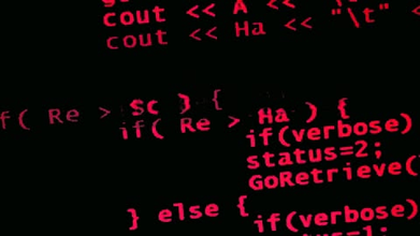

<div align="center">

# Evelyn Faubla Ordóñez

**Full-Stack Software Engineer · AI-Powered Applications**

Construyo soluciones de software que combinan **tecnología, datos e inteligencia artificial** para generar impacto real.

Manta, Ecuador · ULEAM · Open to internships & Junior Full-Stack/AI · Remote LATAM

<br/>

[](https://linkedin.com/in/evelyn-faubla)
[](mailto:evielisfauordo05@gmail.com)
[](https://github.com/vivileef)
[](https://agro-guardian-ai-bice.vercel.app)

</div>

---

<table>
<tr>
<td width="50%" valign="top">

<table>
<tr>
<td width="38%" valign="top" align="center">


</td>
<td width="62%" valign="top">

## Sobre mí

Estudiante avanzada de **Ingeniería en Software** en la ULEAM. Apasionada por el desarrollo Full-Stack y las aplicaciones con IA.

- 🏆 Ganadora del **Codex Buildathon** con *AgroGuardian AI*
- 🎓 **Aspire Leader** · Harvard University
- 🇯🇵 Aceptada en **GCI World 2026** · Lab. Matsuo · Univ. de Tokio
- 👩‍💻 Fundadora de **Women STEM Manta**
- 💜 Engineering Chair · **IEEE WIE**
- ☁️ Certificada **OCI AI Foundations Associate**

</td>
</tr>
</table>

</td>
<td width="50%" valign="top">

## Stack técnico

**Lenguajes**


**Frontend**


**Backend & DB**


**IA & Cloud**


</td>
</tr>
</table>

---

## Proyectos destacados

<table>
<tr>
<td width="50%" valign="top">

### [GemelaAI](https://github.com/vivileef/Gemela-AI)

Plataforma de salud femenina con gemelas digitales y motor de reportes con IA.

`React` `TypeScript` `Node.js` `Supabase` `OpenAI`

</td>
<td width="50%" valign="top">

### [AgroGuardian AI](https://github.com/vivileef/AgroGuardian-AI) · 🏆

Agrónomo inteligente con visión por computadora e IA multi-agente.

[`Demo live →`](https://agro-guardian-ai-bice.vercel.app) · `Next.js` `TypeScript` `OpenAI`

</td>
</tr>
<tr>
<td width="50%" valign="top">

### [SGEpro](https://github.com/vivileef/SGEpro-react)

Sistema de gestión de prácticas preprofesionales con 4 roles.

`Next.js` `React` `TypeScript` `Tailwind`

</td>
<td width="50%" valign="top">

### [Ferias y Emprendimientos](https://github.com/vivileef/Plataforma-de-ferias-y-emprendimientos-estudiantiles--IHC)

Marketplace multi-rol para emprendimientos estudiantiles ULEAM.

`Next.js` `React` `TypeScript` `Radix UI`

</td>
</tr>
</table>

[](https://github.com/vivileef?tab=repositories)

---

<table>
<tr>
<td width="58%" valign="top">

## Liderazgo y reconocimientos

- 👩‍💻 Fundadora · **Women STEM Manta**
- 💜 Engineering Chair · **IEEE WIE** · IEEE ULEAM · IEEE RAS
- 🌍 **Aspire Leader** · Harvard University
- 🔬 **GCI World 2026** · Lab. Matsuo · Univ. de Tokio
- 🎖️ Ganadora · **Women in Cloud** (WIC)
- 🔐 Hacker Women in Council · Women Cisco *(en formación)*

</td>
<td width="42%" align="center" valign="middle">


</td>
</tr>
</table>

---

<div align="center">

## GitHub Stats


<br/>


</div>

---

<table>
<tr>
<td width="68%" valign="top">

## Terminal

```bash
evelyn@uleam:~$ neofetch

       ███████╗██╗   ██╗███████╗██╗     ██╗   ██╗███╗   ██╗
       ██╔════╝██║   ██║██╔════╝██║     ██║   ██║████╗  ██║
       █████╗  ██║   ██║█████╗  ██║     ██║   ██║██╔██╗ ██║
       ██╔══╝  ╚██╗ ██╔╝██╔══╝  ██║     ██║   ██║██║╚██╗██║
       ███████╗ ╚████╔╝ ███████╗███████╗╚██████╔╝██║ ╚████║
       ╚══════╝  ╚═══╝  ╚══════╝╚══════╝ ╚═════╝ ╚═╝  ╚═══╝

       OS........... ULEAM · Software Engineering · Manta, Ecuador
       Role......... Full-Stack Software Engineer · AI-Powered Applications
       Stack........ TypeScript · React · Next.js · Python · Supabase · OpenAI
       Highlight.... Codex Buildathon Winner · AgroGuardian AI
       Leadership... Founder · Women STEM Manta · IEEE WIE Engineering Chair
       Status....... Open to internships · Junior Full-Stack/AI · Remote LATAM

       # ｡˚ software whispers
       # ✿ code, AI & digital wonders
       # ❝ not everything revolutionary is loud ❞
       # 🪐 observing the future in real time
```

</td>
<td width="32%" align="center" valign="middle">



</td>
</tr>
</table>

---

<table>
<tr>
<td width="32%" align="center" valign="middle">


</td>
<td width="68%" align="center" valign="middle">

### Conectemos

[](https://linkedin.com/in/evelyn-faubla)
[](mailto:evielisfauordo05@gmail.com)
[](https://github.com/vivileef)

<br/>

*La tecnología es el medio. El impacto es el objetivo.* 💜

<br/>

*｡˚ software whispers · ✿ code, AI & digital wonders*

*❝ not everything revolutionary is loud ❞ · 🪐 observing the future in real time*

</td>
</tr>
</table>

<details>
<summary><b>English version</b></summary>
<br/>

Full-Stack Software Engineer · AI-Powered Applications · ULEAM, Ecuador

- Codex Buildathon Winner · *AgroGuardian AI* · [live demo](https://agro-guardian-ai-bice.vercel.app)
- GCI World 2026 · Matsuo Lab · University of Tokyo
- Aspire Leader · Harvard · Women in Cloud · IEEE WIE Engineering Chair

*Technology is the means. Impact is the goal.*

</details>
