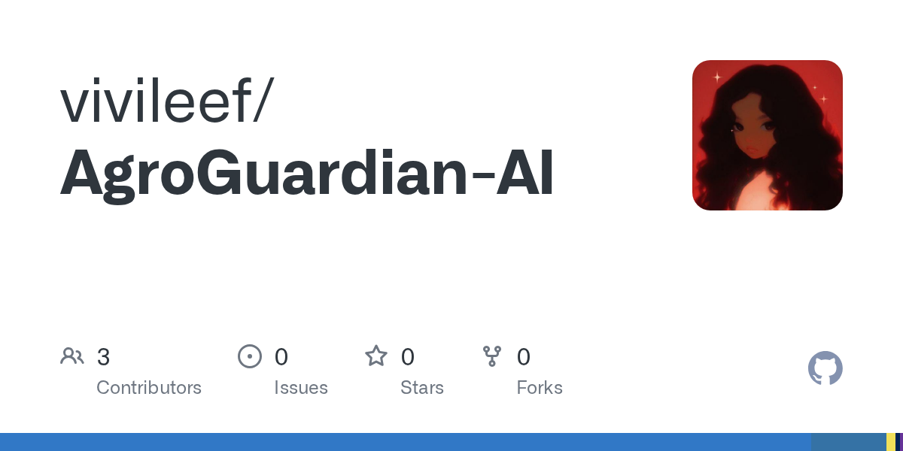
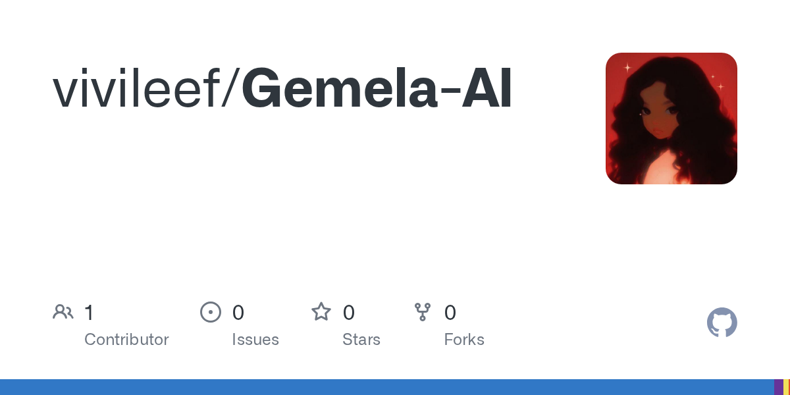
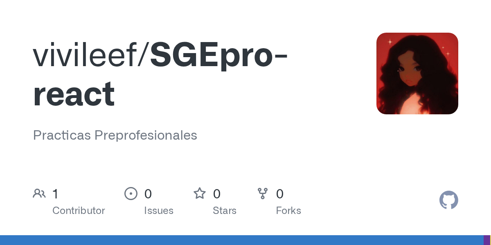
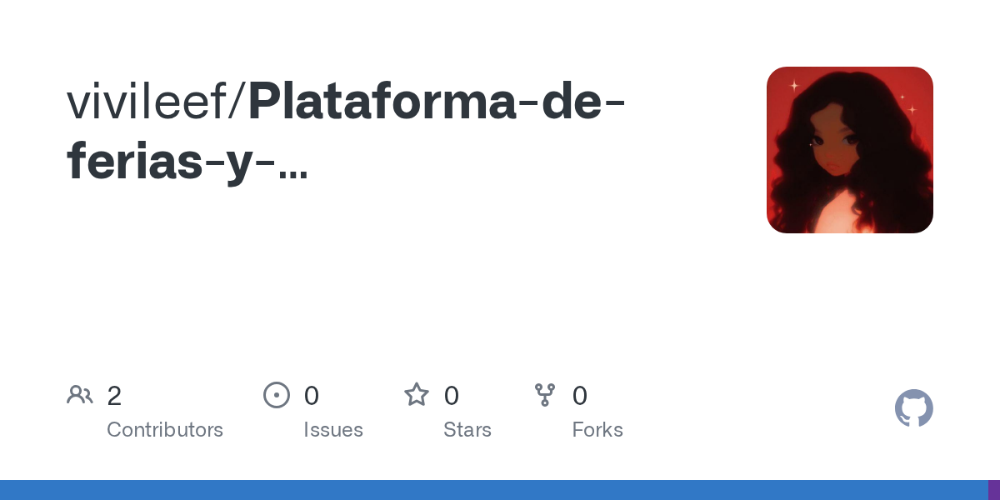

 

｡˚ software whispers 
✿ code, AI & digital wonders 
❝ not everything revolutionary is loud ❞ 
🪐 observing the future in real time

 

 

*Open to internships · Junior Full-Stack/AI roles · Remote LATAM*

---

## Sobre mí

Construyo **aplicaciones web e inteligencia artificial** que resuelven problemas reales en salud, educación y sector productivo.

- **Ganadora del Codex Buildathon** con *AgroGuardian AI* — visión por computadora e IA multi-agente
- **Aceptada en GCI World 2026** — Laboratorio Matsuo, Universidad de Tokio
- **Aspire Leader**, Harvard University · Beca internacional **Women in Cloud**
- **Fundadora de Women STEM Manta** · Engineering Chair, **IEEE WIE**
- Certificada **OCI AI Foundations Associate** · Azure AI *(en proceso)*

---

## Stack

---

## Proyectos destacados

<table width="100%">
<tr>
<td width="50%" valign="top">

**[AgroGuardian AI](https://github.com/vivileef/AgroGuardian-AI)** · Codex Buildathon Winner

Agrónomo inteligente con visión por computadora, pipeline multi-agente de IA y reportes agronómicos en tiempo real.

[`Demo live →`](https://agro-guardian-ai-bice.vercel.app)

`Next.js` · `TypeScript` · `OpenAI` · `Supabase`

</td>
<td width="50%" valign="top">

**[GemelaAI](https://github.com/vivileef/Gemela-AI)**

Plataforma de salud femenina con gemelas digitales, expediente clínico y motor de reportes con IA.

`React` · `TypeScript` · `Node.js` · `Supabase` · `OpenAI`

</td>
</tr>
<tr>
<td width="50%" valign="top">

**[SGEpro](https://github.com/vivileef/SGEpro-react)**

Sistema de gestión de prácticas preprofesionales con 4 roles y flujo académico completo.

`Next.js` · `React` · `TypeScript` · `Tailwind CSS`

</td>
<td width="50%" valign="top">

**[Ferias y Emprendimientos](https://github.com/vivileef/Plataforma-de-ferias-y-emprendimientos-estudiantiles--IHC)**

Marketplace multi-rol para emprendimientos estudiantiles con catálogo, carrito y paneles por usuario.

`Next.js` · `React` · `TypeScript` · `Radix UI`

</td>
</tr>
</table>

---

## Liderazgo y reconocimientos

| | |
|:--|:--|
| Comunidad | Fundadora · **Women STEM Manta** |
| IEEE | Engineering Chair · **IEEE WIE** · IEEE ULEAM · IEEE RAS |
| Internacional | **Aspire Leader** · Harvard University |
| Investigación | **GCI World 2026** · Lab. Matsuo · Univ. de Tokio |
| Becas | Ganadora · **Women in Cloud** (WIC) |
| Seguridad | Hacker Women in Council · Women Cisco *(en formación)* |

---

## GitHub

---

<b>English version</b>

 

**Full-Stack Software Engineer · AI-Powered Applications** · ULEAM, Ecuador

- Codex Buildathon Winner · *AgroGuardian AI* — computer vision & multi-agent AI
- Accepted · GCI World 2026 · Matsuo Lab · University of Tokyo
- Aspire Leader · Harvard · Women in Cloud International Scholarship
- Founder · Women STEM Manta · Engineering Chair · IEEE WIE

*Technology is the means. Impact is the goal.*

Open to internships · Junior Full-Stack/AI roles · Remote LATAM

---

**¿Proyecto con IA o Full-Stack? Escríbeme.**

 

*La tecnología es el medio. El impacto es el objetivo.*

